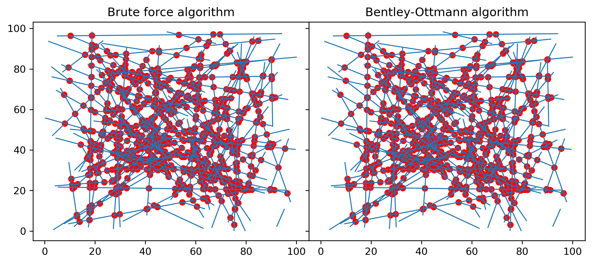
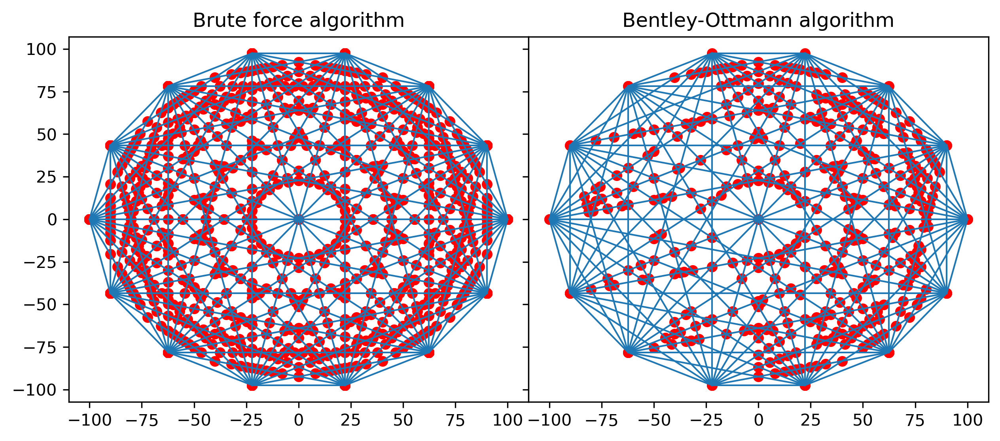

# SegmentIntersections.jl

This package implements two algorithms for computing the intersection points between a set of finite segments. 
   * A brute force algorithm, in which each segment is tested for intersection against all the other segments. The scaling of this algorithm is thus O(N^2). 
   * The [Bentley-Ottmann algorithm](https://en.wikipedia.org/wiki/Bentley%E2%80%93Ottmann_algorithm) which should scale much better for a high number of points. However, in many situations the brute force performs better. This could also be because of the BO algorithm needs a bit of memory optimization.

The intersections for a complete K-graph need to be debugged, probably a toleranece error.

# Limitations

The algorithm ignores purely horizontal and vertical segments. This will probably be implemented in the future.
